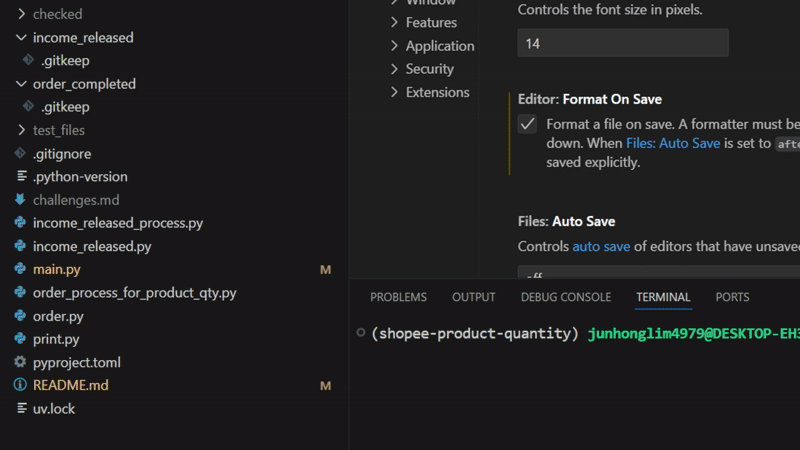

#  **Shopee Product Quantity Excel File**
A Python script to calculate product quantities from Shopee orders that have been paid, for use in generating E-Invoices, which is a mandatory requirement for e-commerce sellers in Malaysia.

## 🎯 Purpose
This script automates the counting of product quantities from Shopee's excel files. It replaces the manual use of pivot tables in Excel, helping to reduce human error and save man-hours. It's also part of my journey in applying Python to solve a problem in my part-time marketing job.

## 🎥 Demo


## 🚀 How to Run
1. **Clone the repository:**

   ```bash
   git clone https://github.com/junhonglim49791/nutriq-shopee-product-quantity.git
   
   cd shopee-product-quantity
   ```  
2. **Install uv:**  
    ```bash
    curl -Ls https://astral.sh/uv/install.sh | sh
    ```
2. **Create a virtual environment:**  
    ```bash
    uv venv
    source .venv/bin/activate
    ```
3. **Install dependencies:**
    ```bash
    uv pip install --locked
    ```

## 🛒 How to Get Product Quantity

1. **Upload `Income.released` file:**  
    Put your excel file in the _income_released folder_ and run the script first to know which  `Order.completed` file(s) to upload. 
    ```bash
    uv run main.py
    ```
    > Ignore the `.gitkeep` file in _income_released_ and _order_completed_ as it will be removed if it exists. This file is only there to ensure Git keeps these two > empty folders, as they will be used by the user.

2. **Upload `Order.completed` file(s):**  
    Put your excel file(s) in the _order_completed_ folder and run the script again, using the command above, to generate `Product.quantity` excel file in _shopee-product-quantity_ folder.

3. **Copy `Product.quantity` file to Windows:**  
   Open the file explorer in WSL:Ubuntu, then drag and drop to Windows.
     ```bash
    explorer.exe .
    ```   

## 📝 Notes

- Resizing the terminal might cause the rich's Panel outline to be out of shape
