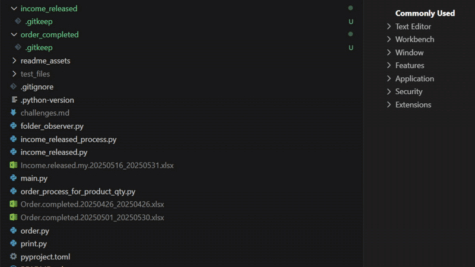

#  **Shopee Product Quantity Excel File**
A Python script to calculate product quantities from Shopee orders that have been paid, for use in generating E-Invoices, which is a mandatory requirement for e-commerce sellers in Malaysia.

## 🎯 Purpose
This script automates the counting of product quantities from Shopee's excel files. It replaces the manual use of pivot tables in Excel, helping to reduce human errors and save man-hours. It's also part of my journey in applying Python to solve a problem in my part-time marketing job.

## 🎥 Demo


## 🚀 How to Run
1. **Clone the repository:**

   ```bash
   git clone https://github.com/junhonglim49791/nutriq-shopee-product-quantity.git
   
   cd nutriq-shopee-product-quantity
   ```  
2. **Install uv:**  
    ```bash
    curl -Ls https://astral.sh/uv/install.sh | sh
    ```
3. **Create a virtual environment (Optional):**  
    ```bash
    uv venv
    source .venv/bin/activate
    ```
4. **Install dependencies (Optional):**
    ```bash
    uv pip install -r pyproject.toml
    ```
> Step 3 and step 4 becomes optional because `uv run` automatically create and update the project environment. Check [uv's documentation](https://docs.astral.sh/uv/reference/cli/#uv-run).

## 🛒 How to Get Product Quantity

1. **Upload `Income.released` file:**   
    To upload files, just drag and drop from Windows to VS code. 
    Put your excel file in the ***income_released*** folder. Run the script (Ctrl+C to stop), if the filechecks passed, required `Order.completed` filename(s) will be shown. 
    ```bash
    uv run main.py
    ```
    The script will tell user whether uploaded file is accepted:

    
    > Ignore the `.gitkeep` file in ***income_released*** and ***order_completed*** folder as it will be removed after running the script. These file is to ensure Git keeps these two empty folders for user.
     
2. **Upload `Order.completed` file(s):**  
    Put your excel file(s) in the ***order_completed*** folder. If filechecks passed, then generate `Product.quantity` excel file in ***shopee-product-quantity*** folder.  

    The script will tell user whether uploaded file(s) is accepted:

    
3. **Copy `Product.quantity` file to Windows:**  
    Open the file explorer in Ubuntu, drag and drop the generated excel file to Windows
    ```bash   
    explorer.exe .
    ```


## 📝 Notes
- ✅ Shopee's Order.Completed excel file has certian bold styles on 'Product Name' column, which causes duplicate issues and messes sorting in Excel's Pivot Table.
  
  

---
- ✅ Resizing the terminal might cause the rich's Panel outline to be "eaten"
  - Before:   
<p align="center">
    
    <br>
    <strong><em>Eating previous output</em></strong>
</p>

  - After:
<p align="center">
    
    <br>
    <strong><em>Order Completed Error Message Panel</em></strong>
</p>
<br>
<p align="center">
    
    <br>
    <strong><em>Income Released Error Message Panel</em></strong>
</p>

***

- If a file from Windows is drag and drop to Ubuntu in file explorer, there would be a Zone.Identifier file

